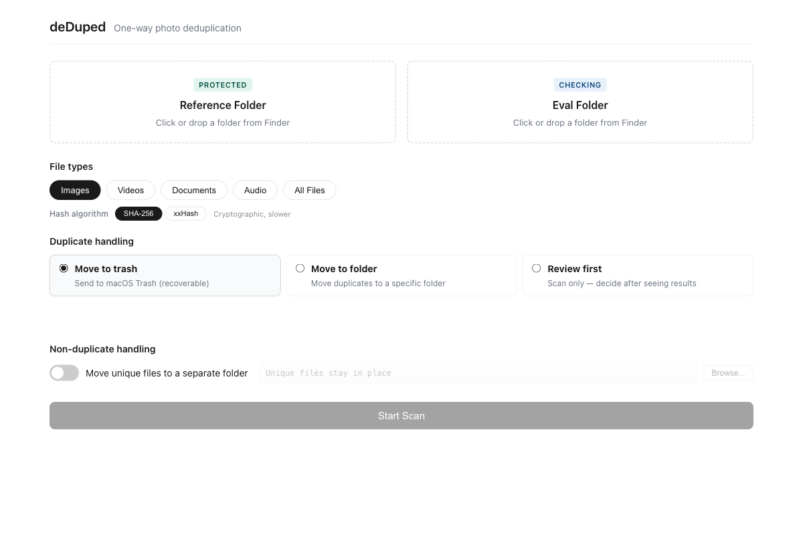
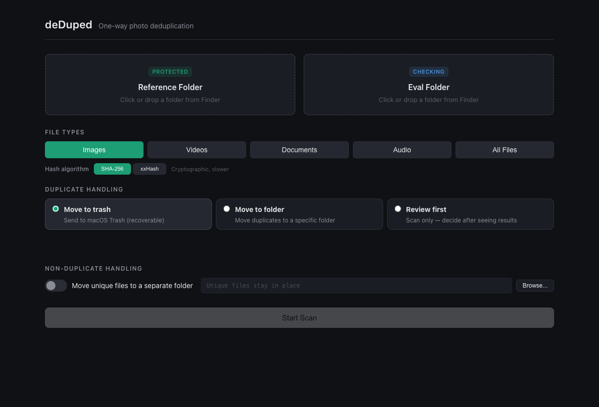

# deDuped

A macOS desktop app for **one-way file deduplication**. Point it at your existing library (reference) and a pile of unsorted files (eval) — it hashes everything, finds duplicates, and lets you trash or move them. The reference folder is never modified.

## Screenshots

<p align="center">
  
</p>

<p align="center">
  
</p>

## Why this exists

Every dedup tool does two-way dedup: "find duplicates across these folders." That's dangerous when you have a 60k+ file library and incoming files — you don't want to accidentally flag library copies for deletion.

deDuped's core differentiator is the **one-directional model**: the reference folder is read-only, period. Only eval files get acted on.

## Features

- **One-way dedup** — reference folder is never touched
- **Parallel hashing** — SHA-256 or xxHash (xxh3), parallelized with rayon
- **Perceptual matching** — dHash-based near-duplicate detection catches visually identical images with different metadata, compression, or format
- **Hash cache** — SQLite-backed; unchanged files aren't rehashed between runs
- **File type categories** — scan Images, Videos, Documents, Audio, or all files
- **Three duplicate modes** — move to trash, move to folder, or review first
- **Sidecar handling** — XMP files automatically follow their parent photo
- **Structure preservation** — moved files keep their subfolder hierarchy
- **Collision handling** — filename conflicts resolved with `-1`, `-2` suffixes
- **Drag-and-drop** — drag folders from Finder onto the picker areas
- **Session persistence** — remembers your last-used folders and settings
- **Export reports** — save scan results as CSV or JSON
- **Intra-eval detection** — catches duplicates within the eval folder itself
- **Empty dir cleanup** — removes empty directories after file operations

## Quick start

### Prerequisites

- [Rust](https://rustup.rs/) (stable)
- [Node.js](https://nodejs.org/) (v18+)
- macOS (uses native APIs for trash, folder pickers, etc.)

### Development

```bash
npm install
cargo tauri dev
```

### Build

```bash
cargo tauri build
```

The `.app` bundle is at `src-tauri/target/release/bundle/macos/deDuped.app`. Copy it to `/Applications` or another Mac via AirDrop. Right-click → Open on first launch to bypass the unsigned app warning.

### Tests

```bash
cd src-tauri
cargo test
```

59 tests: unit tests for hashing, caching, perceptual hashing, and file operations, plus integration tests covering the full scan pipeline, cache behavior, file moves with sidecars, collision handling, category filtering, and CSV export.

## Usage

### 1. Select folders

Pick your **reference** folder (existing library — never modified) and **eval** folder (incoming files to check). Click the picker areas or drag folders from Finder.

### 2. Configure scan

**File types** — select which categories to include: Images (default), Videos, Documents, Audio, or All Files.

**Hash algorithm** — SHA-256 (default, cryptographic) or xxHash (faster, non-cryptographic). Switching algorithms triggers a full re-hash since cached hashes are algorithm-specific.

**Perceptual matching** — enable to find visually similar images that aren't byte-identical (e.g., same photo with different metadata, recompression, or format). Choose a sensitivity preset:
- **Strict** — metadata changes, recompression
- **Moderate** — quality differences, minor crops
- **Loose** — significant changes (review matches carefully)

Supported formats: JPEG, PNG, TIFF, BMP, WebP. Requires an image category to be selected.

**Duplicate handling:**
- **Move to trash** — sends duplicates to macOS Trash (recoverable)
- **Move to folder** — relocates duplicates to a chosen directory, preserving subfolder structure
- **Review first** — scan only, decide what to do after seeing results

**Non-duplicate handling** — optionally move unique files to a separate folder (off by default).

### 3. Scan

The app walks both directories, hashes all matching files (using cached hashes where possible), and compares eval files against the reference set. Progress is shown in real-time.

### 4. Results

Results are grouped into three categories:
- **Exact** (red) — byte-identical content hash matches
- **Similar** (amber) — perceptual matches with a similarity percentage (only when perceptual matching is enabled)
- **Unique** (green) — no match found

Use the selection buttons (Select All, Select Exact, Select Similar) to choose which files to act on. From here you can:

- Execute the chosen action (trash or move selected files)
- Export results as CSV or JSON
- Go back and start a new scan

## How it works

### Hashing

Files are compared by content hash, not filename. Two files with different names but identical bytes are duplicates. Two files with the same name but different content are not.

deDuped offers two algorithms:

| Algorithm | Speed | Use case |
|-----------|-------|----------|
| SHA-256 | ~200 MB/s | Default. Cryptographic-strength collision resistance. |
| xxHash (xxh3) | ~5 GB/s | When speed matters more than theoretical collision resistance. Fine for photo dedup. |

Hashing is parallelized across CPU cores using rayon. A 128 KB read buffer is used for throughput on large files (RAW photos, videos).

### Cache

A SQLite database at `~/Library/Application Support/com.photodedup/cache.db` stores hashes keyed by `(path, algorithm, size, mtime)`. If a file hasn't changed since the last scan, its cached hash is reused. This makes repeat scans of large libraries near-instant.

The cache is pruned on each run — entries for deleted files are removed automatically.

### Duplicate detection

**Content hashing (exact matches):**
1. Hash all reference files → build a set of known hashes
2. Hash all eval files → compare each against the reference set
3. Detect intra-eval duplicates — if the eval folder itself contains identical files, only the first (by path sort order) is kept as "unique"

**Perceptual matching (similar matches):**
4. If enabled, compute a 64-bit dHash (difference hash) for all reference images and non-exact eval images
5. Compare each eval dHash against all reference dHashes using Hamming distance
6. Flag files below the sensitivity threshold as "similar"

dHash works by resizing the image to 9x8 grayscale and comparing each pixel to its right neighbor, producing a compact fingerprint that's invariant to metadata, compression, and minor visual changes. Perceptual hashes are cached alongside content hashes.

Eval results are sorted by path before comparison, so duplicate detection is deterministic regardless of cache state.

### File operations

**Safety guarantees:**
- Files are **never permanently deleted**. "Delete" always means macOS Trash (recoverable).
- The **reference folder is never modified** — no reads, no writes, no deletes.
- **Move** uses `rename` when possible (atomic, same filesystem). Falls back to copy-then-delete for cross-filesystem moves. If copy succeeds but delete fails, the error is reported — the file exists in both locations rather than being lost.
- **Sidecars** (`.xmp` files) are automatically moved or trashed alongside their parent photo. Sidecar handling is best-effort — a sidecar failure never blocks the primary file operation.
- **Collisions** at the destination are resolved by appending `-1`, `-2`, etc. before the file extension. Files are never silently overwritten.
- **Empty directories** in the eval folder are cleaned up bottom-up after all operations complete.

### File type categories

| Category | Extensions |
|----------|-----------|
| Images | jpg, jpeg, png, tif, tiff, bmp, webp, heic, heif, cr2, cr3, nef, arw, orf, rw2, dng, raf, pef, srw, x3f |
| Videos | mp4, mov, avi, mkv, m4v, wmv, flv, webm, mts, m2ts |
| Documents | pdf, doc, docx, xls, xlsx, ppt, pptx, txt, rtf, md, csv, psd, ai, indd, sketch, fig |
| Audio | mp3, flac, aac, wav, aiff, ogg, m4a, wma, alac |
| All Files | Everything except hidden files and `.DS_Store` |

Multiple categories can be selected simultaneously.

## Project structure

```
src/                        # React + TypeScript frontend
  App.tsx                   # Screen routing and state
  main.tsx                  # Entry point
  types.ts                  # Shared type definitions
  styles.css                # All styles
  screens/
    SetupScreen.tsx         # Folder pickers, categories, config
    ScanningScreen.tsx      # Progress bar with real-time events
    ResultsScreen.tsx       # Summary, file list, actions, export

src-tauri/                  # Rust backend
  src/
    hasher.rs               # File collection, SHA-256/xxHash, parallel hashing
    perceptual.rs           # dHash computation and Hamming distance
    cache.rs                # SQLite hash cache with algorithm-aware keys
    fileops.rs              # Trash, move, sidecar handling, dir cleanup
    commands.rs             # Tauri commands: scan_folders, execute_action, export_report
    tests.rs                # 59 unit + integration tests
    lib.rs                  # Plugin registration and command handler
    main.rs                 # Binary entry point
  tauri.conf.json           # App config (window size, permissions, build)
  capabilities/default.json # Tauri security permissions
  Cargo.toml                # Rust dependencies
```

## Tech stack

| Component | Technology |
|-----------|-----------|
| App framework | [Tauri 2](https://tauri.app/) |
| Backend language | Rust |
| Frontend | React 19 + TypeScript |
| Build tool | Vite |
| Hashing | `sha2` (SHA-256), `xxhash-rust` (xxh3), `image` (perceptual dHash) |
| Parallelism | `rayon` |
| Cache | `rusqlite` (SQLite, bundled) |
| File traversal | `walkdir` |
| Trash | `trash` crate (macOS native) |
| Dialogs | `tauri-plugin-dialog` (NSOpenPanel / NSSavePanel) |

## License

This project is unlicensed. All rights reserved.
